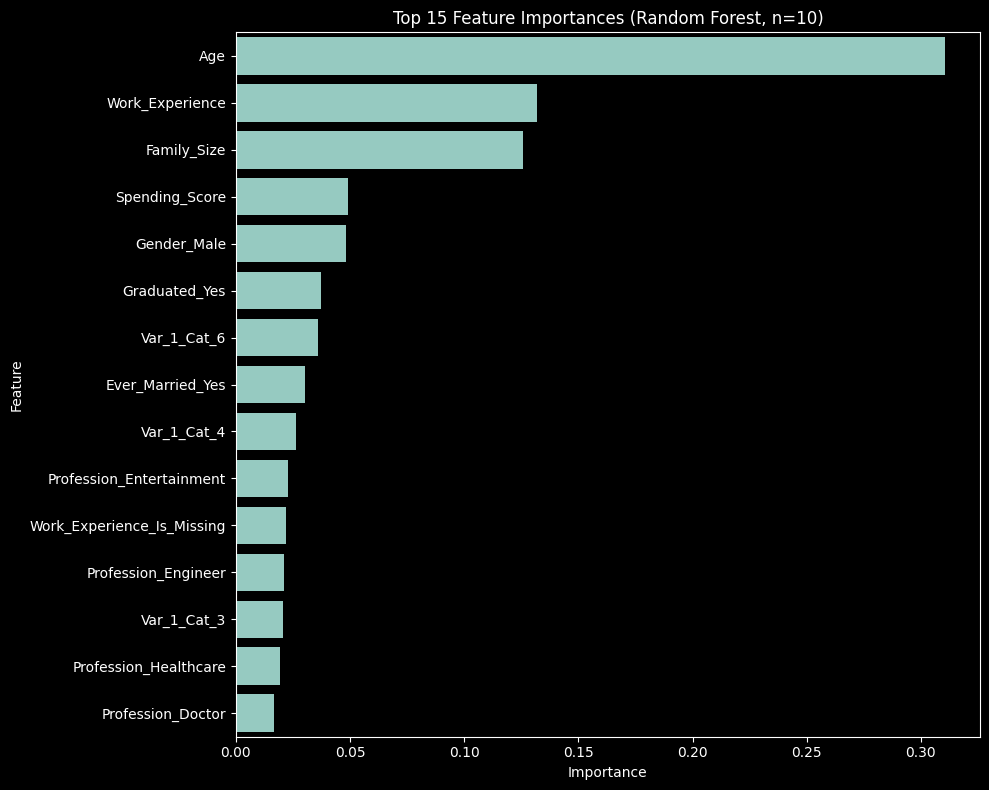

# Section 1 Report

## 1. How does class imbalance affect multiclass classification, and what strategies can be employed to mitigate its impact, especially with small datasets?

Class imbalance is when few classes in dataset have significantly fewer samples than others.

1. **Biased Learning:** To optimize for accuracy, models can simply learn to predict the majority class every time, while ignoring the minority classes.
2. **Poor Minority Class Performance:** Model sees minority class examples very rarely, so it doesn't get to learn their underlying patterns properly. This results in low precision and recall for those classes.
3. **Misleading Accuracy Metric:** Overall accuracy is a poor measure of performance. A model can have 90% accuracy but 0% recall for minority classes that makes up 10% of data.

Strategies to mitigate impact:

1. **Appropriate Evaluation Metrics:** Instead of just accuracy, focus on precision, recall, F1-Score per class, and confusion matrix.
2. **Stratified Splitting:** Ensures that proportion of each class is same in both splits. Prevents scenarios like where the validation set accidently contains very few or no samples of minority class.
3. **Resampling:** Oversampling the minority class by creating copies of the minority class, or undersampling the majority class by removing copies of the majority class (risky on small datasets).

## 2. How can the choice of hyperparameters make the random forest classifier and SVM classifiers more prone to over or under fitting?

### Random Forest Classifier

- **Overfitting (High Variance):** A random forest overfits when it's individual decision trees are too complex and have memorized the training data, including noise.
  - `n_estimators`: Generally more trees makes the model more robust, but in our case the performance decreased. This suggests that each of the 10 trees was already complex enough and adding more contributed in overfitting.
  - `max_depth`: If depth of each tree is unlimited, trees can grow until they perfectly classify the entire data (high variance). Limiting depth simplifies the trees reducing overfitting.
- **Underfitting (High Bias):** A random forest underfits when it's too simple to capture the underlying patterns.
  - `n_estimators`: A low number can lead to high bias as predictions are not stabilized by averaging many trees.
  - `max_depth`: A small value can prevent the trees from capturing complex relationships.

### SVM Classifier (With RBF Kernel)

- **Overfitting (High Variance):** An RBF SVM overfits when the decision boundary is too flexible and wraps tightly around individual data points.
  - `C` (Regularization Parameter): A high `C` tells the model to prioritize classifying every training point correctly. This leads to complex boundaries and overfitting.
  - `gamma`: A high gamma means that each training sample has a very localized influence. This also leads to complex boundaries and overfitting.
- **Underfitting (High Bias):** When decision boundary is too simple.
  - `C`: Low `C` values allows larger margin and more misclassifications.
  - `gamma`: Low gamma values means each training data has a broad influence leading to smoother boundaries.

## 3. Plot the confusion matrix and include the precision, recall, f1-score metrics in the report

### Classification Report

| | precision | recall | f1-score | support |
|:---|---:|---:|---:|---:|
| A | 0.34 | 0.42 | 0.38 | 116 |
| B | 0.25 | 0.22 | 0.23 | 78 |
| C | 0.24 | 0.20 | 0.22 | 64 |
| D | 0.35 | 0.33 | 0.34 | 110 |
| **accuracy** | | | **0.31** | **368** |
| **macro avg** | 0.30 | 0.29 | 0.29 | 368 |
| **weighted avg**| 0.31 | 0.31 | 0.31 | 368 |

### Confusion Matrix

| | A | B | C | D |
|:---|---:|---:|---:|---:|
| **A** | 49 | 20 | 15 | 32 |
| **B** | 32 | 17 | 12 | 17 |
| **C** | 24 | 10 | 13 | 17 |
| **D** | 39 | 20 | 15 | 36 |

## 4.  Compare the results obtained for one-vs-one and one-vs-all (which according to you performs better for the above dataset)

For this dataset, OvO performs just slightly better than OvA. This might be because OvA trains classifiers for K classes. Each classifier is trained on entire dataset. OvO trains many more classifiers, each classifier is trained only on a subset of data belonging to the 2 classes it separates. This makes OvO less prone to class imbalance as each binary problem would be more balanced.
By breaking the complex 4-class problem into 6 simpler binary problems, each SVM can create a more specialized and effective decision boundary.
